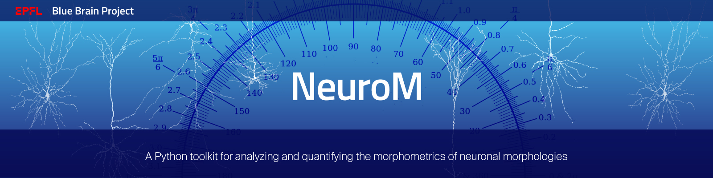

<!--
 Copyright (c) 2015, Ecole Polytechnique Federale de Lausanne, Blue Brain Project
 All rights reserved.

 This file is part of NeuroM <https://github.com/BlueBrain/NeuroM>

 Redistribution and use in source and binary forms, with or without
 modification, are permitted provided that the following conditions are met:

     1. Redistributions of source code must retain the above copyright
        notice, this list of conditions and the following disclaimer.
     2. Redistributions in binary form must reproduce the above copyright
        notice, this list of conditions and the following disclaimer in the
        documentation and/or other materials provided with the distribution.
     3. Neither the name of the copyright holder nor the names of
        its contributors may be used to endorse or promote products
        derived from this software without specific prior written permission.

 THIS SOFTWARE IS PROVIDED BY THE COPYRIGHT HOLDERS AND CONTRIBUTORS "AS IS" AND
 ANY EXPRESS OR IMPLIED WARRANTIES, INCLUDING, BUT NOT LIMITED TO, THE IMPLIED
 WARRANTIES OF MERCHANTABILITY AND FITNESS FOR A PARTICULAR PURPOSE ARE
 DISCLAIMED. IN NO EVENT SHALL THE COPYRIGHT HOLDER OR CONTRIBUTORS BE LIABLE FOR ANY
 DIRECT, INDIRECT, INCIDENTAL, SPECIAL, EXEMPLARY, OR CONSEQUENTIAL DAMAGES
 (INCLUDING, BUT NOT LIMITED TO, PROCUREMENT OF SUBSTITUTE GOODS OR SERVICES;
 LOSS OF USE, DATA, OR PROFITS; OR BUSINESS INTERRUPTION) HOWEVER CAUSED AND
 ON ANY THEORY OF LIABILITY, WHETHER IN CONTRACT, STRICT LIABILITY, OR TORT
 (INCLUDING NEGLIGENCE OR OTHERWISE) ARISING IN ANY WAY OUT OF THE USE OF THIS
 SOFTWARE, EVEN IF ADVISED OF THE POSSIBILITY OF SUCH DAMAGE.
 -->

# NeuroM

NeuroM is a Python toolkit for the analysis and processing of neuron morphologies.

## Documentation

NeuroM documentation is built and hosted on [readthedocs](https://readthedocs.org/).

* [latest snapshot](http://neurom.readthedocs.org/en/latest/)
* [latest release](http://neurom.readthedocs.org/en/stable/)

## Migration to v2 or v3 versions

Refer to [the doc page](https://neurom.readthedocs.io/en/latest/migration.html) on this topic.

## Reporting issues

Issues should be reported to the
[NeuroM github repository issue tracker](https://github.com/BlueBrain/NeuroM/issues).
The ability and speed with which issues can be resolved depends on how complete and
succinct the report is. For this reason, it is recommended that reports be accompanied
with
* A minimal but self-contained code sample that reproduces the issue. Minimal means no
  code that is irrelevant to the issue should be included. Self-contained means it should
  be possible to run the code without modifications and reproduce the problem.
* The observed and expected output and/or behaviour. If the issue is an error, the python
  error stack trace is extremely useful.
* The commit ID of the version used. This is particularly important if reporting an error
  from an older version of NeuroM.
* If reporting a regression, the commit ID of the change that introduced the problem
* If the issue depends on data, a data sample which reproduces the problem should be
  up-loaded. But check first whether the error can be reproduced with any of the data
  samples available in the `tests/data` directory.

## Citation

When you use the NeuroM software, we ask you to cite the following (**this includes poster presentations**):

## Funding & Acknowledgements

This project/research received funding from the European Union’s Horizon 2020 Framework Programme for Research and Innovation under the Framework Partnership Agreement No. 650003 (HBP FPA). 
This research was supported by the EBRAINS research infrastructure, funded from the European
Union’s Horizon 2020 Framework Programme for Research and Innovation under the Specific Grant
Agreement No. 945539 (Human Brain Project SGA3).
The development of this software was supported by funding to the Blue Brain Project, a research center of the École polytechnique fédérale de Lausanne (EPFL), from the Swiss government’s ETH Board of the Swiss Federal Institutes of Technology.

For license and authors, see `LICENSE.txt` and `AUTHORS.md` respectively.

Copyright (c) 2015-2022 Blue Brain Project/EPFL
