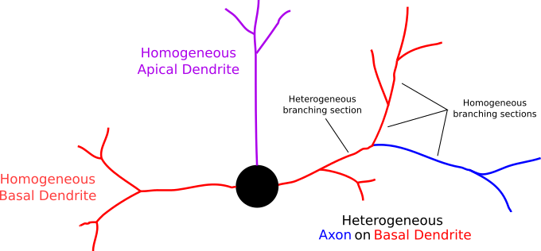
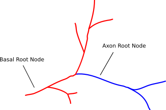

.. Copyright (c) 2022, Ecole Polytechnique Federale de Lausanne, Blue Brain Project
   All rights reserved.

   This file is part of NeuroM <https://github.com/BlueBrain/NeuroM>

   Redistribution and use in source and binary forms, with or without
   modification, are permitted provided that the following conditions are met:

       1. Redistributions of source code must retain the above copyright
          notice, this list of conditions and the following disclaimer.
       2. Redistributions in binary form must reproduce the above copyright
          notice, this list of conditions and the following disclaimer in the
          documentation and/or other materials provided with the distribution.
       3. Neither the name of the copyright holder nor the names of
          its contributors may be used to endorse or promote products
          derived from this software without specific prior written permission.

   THIS SOFTWARE IS PROVIDED BY THE COPYRIGHT HOLDERS AND CONTRIBUTORS "AS IS" AND
   ANY EXPRESS OR IMPLIED WARRANTIES, INCLUDING, BUT NOT LIMITED TO, THE IMPLIED
   WARRANTIES OF MERCHANTABILITY AND FITNESS FOR A PARTICULAR PURPOSE ARE
   DISCLAIMED. IN NO EVENT SHALL THE COPYRIGHT HOLDER OR CONTRIBUTORS BE LIABLE FOR ANY
   DIRECT, INDIRECT, INCIDENTAL, SPECIAL, EXEMPLARY, OR CONSEQUENTIAL DAMAGES
   (INCLUDING, BUT NOT LIMITED TO, PROCUREMENT OF SUBSTITUTE GOODS OR SERVICES;
   LOSS OF USE, DATA, OR PROFITS; OR BUSINESS INTERRUPTION) HOWEVER CAUSED AND
   ON ANY THEORY OF LIABILITY, WHETHER IN CONTRACT, STRICT LIABILITY, OR TORT
   (INCLUDING NEGLIGENCE OR OTHERWISE) ARISING IN ANY WAY OUT OF THE USE OF THIS
   SOFTWARE, EVEN IF ADVISED OF THE POSSIBILITY OF SUCH DAMAGE.

.. _heterogeneous:

Heterogeneous Morphologies
**************************

Definition
----------

A heterogeneous morphology consists of zero or more homogeneous and at least one heterogeneous neurite tree extending from the soma.
A heterogeneous neurite tree consists of multiple sub-neurites with different types (ie: basal and axon).

A typical example of a heterogeneous neurite is the axon-carrying dendrite, in which the axon sprouts from the basal dendrite.

Identification
--------------

Heterogeneous neurites can be identified using the ``Neurite::is_heterogeneous`` method:

.. testcode:: [heterogeneous]

    from neurom import load_morphology
    from neurom.core.morphology import iter_neurites

    m = load_morphology('tests/data/swc/heterogeneous_morphology.swc')

    print([neurite.is_heterogeneous() for neurite in m.neurites])

.. testoutput:: [heterogeneous]
    :hide:

    [False, True, False]

which would return ``[False, True, False]``, meaning the 2nd neurite extending from the soma contains multiple neurite types.

sub-neurite views of heterogeneous neurites
--------------------------------------------

Default mode
~~~~~~~~~~~~

NeuroM does not take into account heterogeneous sub-neurites by default.
A heterogeneous neurite is treated as a homogeneous one, the type of which is determined by the first section of the tree.
For example:

.. testcode:: [heterogeneous]

    basal, axon_carrying_dendrite, apical = list(iter_neurites(m))

    print(basal.type, axon_carrying_dendrite.type, apical.type)

.. testoutput:: [heterogeneous]

    NeuriteType.basal_dendrite NeuriteType.basal_dendrite NeuriteType.apical_dendrite

In other words, the axon-carrying dendrite would be treated as a basal dendrite.

For feature extraction and checks, the axon-carrying dendrite is treated as a basal dendrite.
Features, for which an axon neurite type is passed, do not have access to the axonal part of the neurite.
For instance, the number of basal and axon neurites will be two and zero respectively.
A feature such as ``total_volume`` would include the entire axon-carrying dendrite, without separating between basal and axon types.

subtree mode
~~~~~~~~~~~~

The ``Population``, ``Morphology`` and ``Neurite`` objects have a boolean attribute named ``process_subtrees`` which is set to ``False`` by default.
The value of this attribute can be set to ``True`` in order to take into account heterogeneous sub-neurites.

.. testcode:: [heterogeneous]

    m.process_subtrees = True

    basal, axon_carrying_basal, apical = list(iter_neurites(m))

    print(basal.type, axon_carrying_basal.type, apical.type)

.. testoutput:: [heterogeneous]

    NeuriteType.basal_dendrite NeuriteType.axon_carrying_dendrite NeuriteType.apical_dendrite

In the example above, two views of the axon-carrying dendrite have been created: the basal dendrite view and the axon view.

Given that the topology of the morphology is not modified, the sub-neurites specify as their ``root_node`` the same section of the homogeneous neurite.
So, in this case, both the basal and axon views start at the same section but then the filters used in iterators are different.
This also means that the sub-trees have no 'trunk', as a trunk is defined as a section connected to the soma.

Extract features from heterogeneous morphologies
------------------------------------------------

Neurite
~~~~~~~

Neurite objects have been extended to include a ``process_subtrees`` flag, which can be used to apply a feature on a heterogeneous neurite.

.. testcode:: [heterogeneous]

    from neurom import NeuriteType
    from neurom.features.neurite import number_of_sections

    axon_carrying_dendrite = m.neurites[1]

    axon_carrying_dendrite.process_subtrees = True
    total_sections = number_of_sections(axon_carrying_dendrite)
    basal_sections = number_of_sections(axon_carrying_dendrite, section_type=NeuriteType.basal_dendrite)
    axon_sections = number_of_sections(axon_carrying_dendrite, section_type=NeuriteType.axon)

    print(total_sections, basal_sections, axon_sections)

.. testoutput:: [heterogeneous]

    9 4 5

Not specifying a ``section_type`` is equivalent to passing ``NeuriteType.all`` and it will use all sections as done historically, even if ``process_subtrees`` is set to ``True``.

Morphology
~~~~~~~~~~

Morphology objects have been extended to include the ``process_subtrees`` flag, which allows to use the sub-neurites.

.. testcode:: [heterogeneous]

    from neurom.features.morphology import number_of_neurites

    m.process_subtrees = False
    total_neurites_wout_subneurites = number_of_neurites(m)
    m.process_subtrees = True
    total_neurites_with_subneurites = number_of_neurites(m)

    print("A:", total_neurites_wout_subneurites, total_neurites_with_subneurites)

    m.process_subtrees = False
    number_of_axon_neurites_wout = number_of_neurites(m, neurite_type=NeuriteType.axon)
    m.process_subtrees = True
    number_of_axon_neurites_with = number_of_neurites(m, neurite_type=NeuriteType.axon)

    print("B:", number_of_axon_neurites_wout, number_of_axon_neurites_with)

    m.process_subtrees = False
    number_of_basal_neurites_wout = number_of_neurites(m, neurite_type=NeuriteType.basal_dendrite)
    m.process_subtrees = True
    number_of_basal_neurites_with = number_of_neurites(m, neurite_type=NeuriteType.basal_dendrite)

    print("C:", number_of_basal_neurites_wout, number_of_basal_neurites_with)

.. testoutput:: [heterogeneous]

    A: 3 3
    B: 0 1
    C: 2 2

In the example above, the total number of neurites is the same when the subtrees are enabled (see ``A`` in the print out.)
This is because the axonal and basal parts of the axon-carrying dendrite are counted as one neurite.

Specifying a ``neurite_type``, allows to consider sub-neurites.
Therefore, the number of axons without subtrees is 0, whereas it is 1 when subtrees are enabled (see ``B`` in the print out.)
However, for basal dendrites the number does not change (2) because the axon-carrying dendrite is perceived as basal dendrite in the default case (see ``C``.)

features.get
~~~~~~~~~~~~

``features.get`` can be used with respect to what has been mentioned above for neurite and morphology features.

.. testcode:: [heterogeneous]

    from neurom import features

    m.process_subtrees = True
    n_neurites = features.get("number_of_neurites", m)
    n_sections = features.get("number_of_sections", m, neurite_type=NeuriteType.axon)

    print(f"Neurites: {n_neurites}, Sections: {n_sections}")

.. testoutput:: [heterogeneous]

    Neurites: 3, Sections: 5

.. warning::
    The ``features.get`` function can be used with either the ``neurite_type`` or the ``section_type`` parameter, depending on what type of object the feature is applied.
    When the feature is applied to a ``Population`` or to a ``Morphology`` object, only the ``neurite_type`` parameter is accepted.
    While the feature is applied to a ``Neurite`` or to a list of ``Neurite`` objects, only the ``section_type`` parameter is accepted.

Conventions & Incompatibilities
-------------------------------

Heterogeneous Forks
~~~~~~~~~~~~~~~~~~~

A heterogeneous bifurcation/fork, i.e. a section with children of different types, is ignored when features on bifurcations are calculated.
It is not meaningful to calculate features, such as bifurcation angles, on transitional forks where the downstream subtrees have different types.

Incompatible features with subtrees
~~~~~~~~~~~~~~~~~~~~~~~~~~~~~~~~~~~

The following features are not compatible with subtrees:

* trunk_origin_azimuths
* trunk_origin_elevations
* trunk_angles

Because they require the neurites to be rooted at the soma.
This is not true for sub-neurites.
Therefore, passing a Neurite object with a ``process_subtrees`` flag set to ``True`` will result in an empty list.
