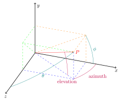

.. Copyright (c) 2015, Ecole Polytechnique Federale de Lausanne, Blue Brain Project
   All rights reserved.

   This file is part of NeuroM <https://github.com/BlueBrain/NeuroM>

   Redistribution and use in source and binary forms, with or without
   modification, are permitted provided that the following conditions are met:

       1. Redistributions of source code must retain the above copyright
          notice, this list of conditions and the following disclaimer.
       2. Redistributions in binary form must reproduce the above copyright
          notice, this list of conditions and the following disclaimer in the
          documentation and/or other materials provided with the distribution.
       3. Neither the name of the copyright holder nor the names of
          its contributors may be used to endorse or promote products
          derived from this software without specific prior written permission.

   THIS SOFTWARE IS PROVIDED BY THE COPYRIGHT HOLDERS AND CONTRIBUTORS "AS IS" AND
   ANY EXPRESS OR IMPLIED WARRANTIES, INCLUDING, BUT NOT LIMITED TO, THE IMPLIED
   WARRANTIES OF MERCHANTABILITY AND FITNESS FOR A PARTICULAR PURPOSE ARE
   DISCLAIMED. IN NO EVENT SHALL THE COPYRIGHT HOLDER OR CONTRIBUTORS BE LIABLE FOR ANY
   DIRECT, INDIRECT, INCIDENTAL, SPECIAL, EXEMPLARY, OR CONSEQUENTIAL DAMAGES
   (INCLUDING, BUT NOT LIMITED TO, PROCUREMENT OF SUBSTITUTE GOODS OR SERVICES;
   LOSS OF USE, DATA, OR PROFITS; OR BUSINESS INTERRUPTION) HOWEVER CAUSED AND
   ON ANY THEORY OF LIABILITY, WHETHER IN CONTRACT, STRICT LIABILITY, OR TORT
   (INCLUDING NEGLIGENCE OR OTHERWISE) ARISING IN ANY WAY OUT OF THE USE OF THIS
   SOFTWARE, EVEN IF ADVISED OF THE POSSIBILITY OF SUCH DAMAGE.

.. _spherical_coordinates:

Spherical coordinates
*********************

Definition
----------

The frame used in NeuroM was chosen so that the biological features are easy to derive from the
coordinate values. Nevertheless, these coordinates are not the standard spherical coordinates and
are thus detailed here.

The NeuroM frame has two coordinates, namely the `elevation` and the `azimuth`. While the two
coordinates of the usual spherical frame are :math:`\theta` and :math:`\phi`.

The following figure compares the NeuroM frame to the standard spherical
frame:

The point :math:`P` is located at :math:`(x, y, z)` in cartesian coordinates and :math:`O` is the
frame center.

The `elevation` is the angle between the vector :math:`\vec{OP}` and the vector
:math:`\vec{OP_{xz}}`, where :math:`P_{xz}` is the projection of :math:`P` on the plane :math:`xz`.

The `azimuth` is the angle between the :math:`X` axis and the vector :math:`\vec{OP_{xz}}`.

Transformations
---------------

The transformation from cartesian coordinates to this frame is the following:

.. math::
    \text{elevation} &= \arcsin(y / \sqrt{x^2 + y^2 + z^2}) \\
    \text{azimuth} &= \arctan(z / x)

The transformation from this frame to cartesian coordinates is the following:

.. math::
    x &= \Vert \vec{OP} \Vert \cos(\text{elevation}) \times \cos(\text{azimuth}) \\
    y &= \Vert \vec{OP} \Vert \sin(\text{elevation}) \\
    z &= \Vert \vec{OP} \Vert \cos(\text{elevation}) \times \sin(\text{azimuth})

The transformation from this frame to usual spherical coordinates is the following:

.. math::
	\theta &= \arccos \left( \sin(\text{azimuth}) \times \cos(\text{elevation}) \right) \\
	\phi &= \arctan \left( \dfrac{\tan (\text{elevation})}{\cos (\text{azimuth})} \right)

The transformation from usual spherical coordinates to this frame is the following:

.. math::
	\text{elevation} &= \arcsin \left( {\sin{\theta} \times \sin{\phi}} \right) \\
	\text{azimuth} &= \arctan \left( {\dfrac{1}{\tan{\theta} \times \cos{\phi}}} \right)
